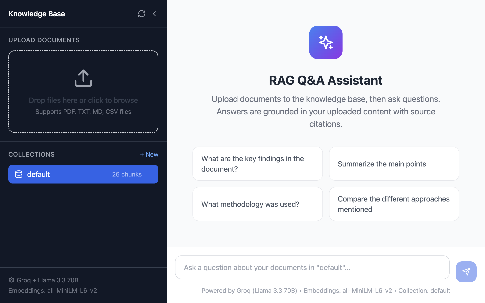
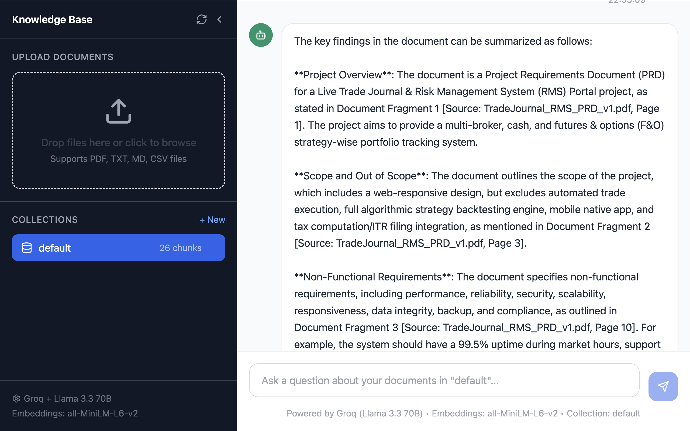

# AI Document Intelligence System

AI Document Intelligence System is a Retrieval-Augmented Generation (RAG) application that lets users upload documents, index them into a vector database, and ask natural-language questions grounded in the uploaded content.

The project uses a FastAPI backend for document ingestion and question answering, a React frontend for the user interface, ChromaDB for vector storage, sentence-transformers for embeddings, and Groq-hosted LLMs for final response generation.

## Screenshots

### Home Screen



### Q&A Response



## Features

- Upload and index `PDF`, `TXT`, `MD`, and `CSV` files
- Create a searchable knowledge base using semantic embeddings
- Ask document-grounded questions through a chat interface
- Retrieve source-backed answers with citation-style references
- Organize knowledge by collection
- View chunk counts and selected model information in the UI

## Tech Stack

### Backend

- Python 3.12
- FastAPI
- Uvicorn
- ChromaDB
- sentence-transformers
- PyPDF
- langchain-text-splitters
- Groq Python SDK

### Frontend

- React
- TypeScript
- Vite
- Tailwind CSS
- lucide-react

## How It Works

1. A user uploads one or more supported documents from the frontend.
2. The backend extracts text from each file and splits it into overlapping chunks.
3. Each chunk is converted into an embedding using `all-MiniLM-L6-v2`.
4. The embeddings and metadata are stored in a ChromaDB collection.
5. When the user asks a question, the backend embeds the query and retrieves the most relevant chunks.
6. The retrieved context is sent to the Groq LLM, which generates a grounded answer.
7. The frontend displays the answer along with source references.

## Project Structure

```text
xyz/
├── README.md
├── requirements.txt
├── install_all_requirements.sh
├── REQUIREMENTS_SETUP.md
├── assets/
│   └── screenshots/
├── rag-qa-system/
│   ├── frontend/
│   └── rag-backend/
└── thesis-diagrams/
```

## Installation

Use the one-step installer from the repository root:

```bash
cd "/Users/dannyjadhav/RAG AI /xyz"
chmod +x install_all_requirements.sh
./install_all_requirements.sh
```

This installer:

- creates a backend virtual environment at `rag-qa-system/rag-backend/.venv`
- installs Python dependencies from `requirements.txt`
- installs frontend dependencies from `rag-qa-system/frontend/package.json`

## Environment Variables

### Backend

Create [`rag-qa-system/rag-backend/.env`](/Users/dannyjadhav/RAG%20AI%20/xyz/rag-qa-system/rag-backend/.env) with:

```env
GROQ_API_KEY=your_groq_api_key
CHROMA_DATA_DIR=./chroma_data
EMBEDDING_MODEL=all-MiniLM-L6-v2
LLM_MODEL=llama-3.3-70b-versatile
```

### Frontend

Create [`rag-qa-system/frontend/.env`](/Users/dannyjadhav/RAG%20AI%20/xyz/rag-qa-system/frontend/.env) with:

```env
VITE_API_URL=http://localhost:8000
```

## Running the Project

### Start the Backend

```bash
cd "/Users/dannyjadhav/RAG AI /xyz/rag-qa-system/rag-backend"
source .venv/bin/activate
uvicorn app.main:app --host 127.0.0.1 --port 8000
```

Backend URLs:

- `http://127.0.0.1:8000`
- `http://127.0.0.1:8000/healthz`

### Start the Frontend

```bash
cd "/Users/dannyjadhav/RAG AI /xyz/rag-qa-system/frontend"
npm run dev -- --host 127.0.0.1 --port 5173
```

Frontend URL:

- `http://127.0.0.1:5173`

## API Overview

### Document Routes

- `POST /api/documents/upload`
- `GET /api/documents/collections`
- `DELETE /api/documents/collections/{name}`
- `GET /api/documents/stats`

### Q&A Route

- `POST /api/qa/ask`

## Current Models

- Embedding model: `all-MiniLM-L6-v2`
- LLM: `llama-3.3-70b-versatile` through Groq

## Notes

- The vector database is stored locally in `rag-qa-system/rag-backend/chroma_data`
- Uploaded files are processed temporarily, but the chunk embeddings remain stored in ChromaDB
- A valid Groq API key is required for answer generation

## Repository

## 👨‍💻 Built by Dnyaneshwar Jadhav

**AI/ML Developer | Quant Developer | Algorithmic Trading Developer | Python Developer**

📱 **Phone:** +91 8806160767
📧 **Email:** [jadhavdnyaneshwar701@gmail.com](mailto:jadhavdnyaneshwar701@gmail.com)
💼 **LinkedIn:** https://linkedin.com/in/dnyaneshwar-jadhav-34112a2a8
🌐 **Portfolio:** https://trademind-ai-xniwrofd.devinapps.com

*"From Data to Alpha."* 📊⚡
